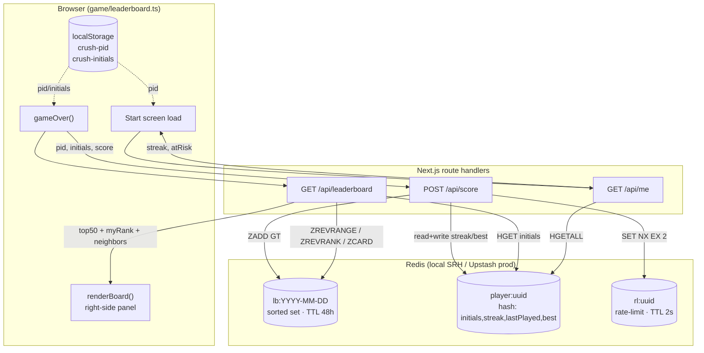
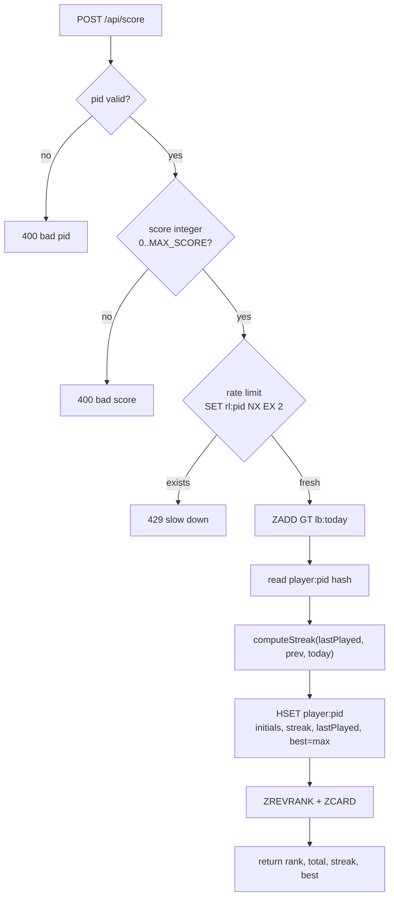
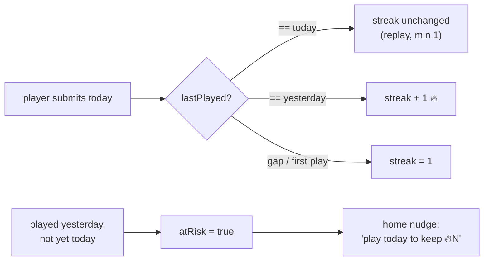
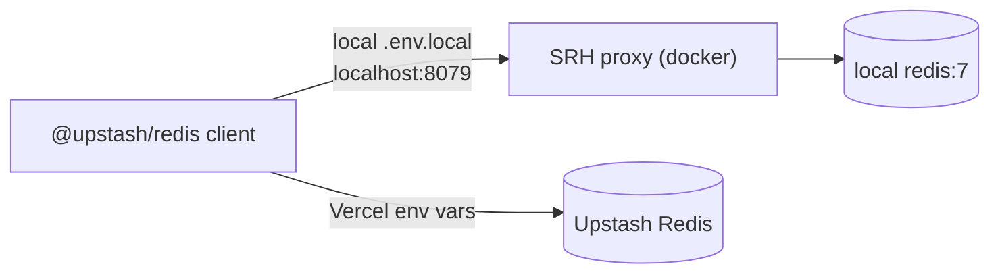

# Leaderboard — Feature Diagrams

Daily-reset leaderboard + streak + neighbors. Anonymous (localStorage id), Redis-backed.

## 1. Data flow (client ↔ API ↔ Redis)

## 2. Submit path — validation, board, streak

## 3. Streak logic (retention core)

## 4. Local vs deploy (same client code)

